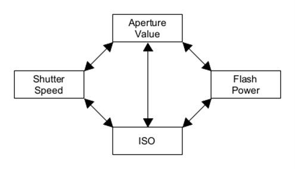

# Photography Guide

## Contents

1. [Terms/Acronyms/Abbreviations](#terms-acronyms-abbreviations)
2. [Characteristics](#characteristics)
   1. [Shutter Speed (SS)](#shutter-speed)
   2. [Aperture Value (AV)](#aperture-value)
   3. [ISO](#iso)
   4. [Flash Power (FP)](#flash-power)
   5. [Values](#values)
3. [Compensate Side Effects](#compensate-side-effects)
   1. [Increase Shutter Speed](#increase-shutter-speed)
   2. [Decrease Shutter Speed](#decrease-shutter-speed)
   3. [Increase Aperture Value](#increase-aperture-value)
   4. [Decrease Aperture Value](#decrease-aperture-value)
   5. [Increase ISO](#increase-iso)
   6. [Decrease ISO](#decrease-iso)
   7. [Increase Flash Power](#increase-flash-power)
   8. [Decrease Flash Power](#decrease-flash-power)
4. [Normal Photography](#normal-photography)
5. [Using Lights](#using-lights)
6. [Shooting Scenarios](#shooting-scenarios)
   1. [Normal Everyday Scene or Stills (e.g. Family, Friends, Portraits, etc.)](#normal-everyday-scene-or-stills-eg-family-friends-portraits-etc)
   2. [Fast Motion (e.g. Sports, Wildlife, Jumping, etc.)](#fast-motion-eg-sports-wildlife-jumping-etc)
   3. [Fast Moving Water Feature (e.g. Waterfall, River, etc.)](#fast-moving-water-feature-eg-waterfall-river-etc)
   4. [Macro (e.g. Insects, Flowers, etc.)](#macro-eg-insects-flowers-etc)
   5. [Multiple Exposures of Motion in a Single Shot (e.g. Ballet, etc.)](#multiple-exposures-of-motion-in-a-single-shot-eg-ballet-etc)
7. [Effects](#effects)
   1. [Motion Blur](#motion-blur)
      1. [Decrease Motion Blur](#decrease-motion-blur)
      2. [Increase Motion Blur](#increase-motion-blur)
   2. [Background/Foreground Blur](#backgroundforeground-blur)
      1. [Increase Background/Foreground Blur](#increase-backgroundforeground-blur)
      2. [Decrease Background/Foreground Blur](#decrease-backgroundforeground-blur)
   3. [Background Exposure](#background-exposure)
      1. [Decrease Background Exposure](#decrease-background-exposure)
      2. [Increase Background Exposure](#increase-background-exposure)
   4. [Shadows](#shadows)
      1. [Sharper Shadows](#sharper-shadows)
      2. [Softer Shadows](#softer-shadows)
      3. [Diffusion Methods](#diffusion-methods)
   5. [Background Colour Temperature](#background-colour-temperature)
      1. [Make Background Blue](#make-background-blue)
      2. [Make Background Orange](#make-background-orange)
   6. [Other Effects](#other-effects)
      1. [Add Bloom to Subject](#add-bloom-to-subject)

## Terms/Acronyms/Abbreviations

- EV - Exposure Value
- SS - Shutter Speed
- AV - Aperture Value
- FP - Flash Power
- BG - Background
- SJ - Subject
- ↑ - Increase
- ↓ - Decrease

## Characteristics

- Shutter Speed (SS)

  - Faster (Larger Denominator)
    - Darker (↓ BG EV)
    - Less Blur
  - Slower (Smaller Denominator)
    - Brighter (↑ BG EV)
    - More Blur

- Aperture Value (AV)

  - Higher (Smaller Opening)
    - Darker (↓ EV)
    - Less Blur
  - Lower (Larger Opening)
    - Brighter (↑ EV)
    - More Blur

- ISO

  - Higher
    - Brighter (↑ EV)
    - More Grain
  - Lower
    - Darker (↓ EV)
    - Less Grain

- Flash Power (FP)
  - Higher (1/1 or 10.0)
    - Brighter (↑ SJ EV)
  - Lower (1/512 or 0.1)
    - Darker (↓ SJ EV)

### Values

<table class="values">
  <thead>
    <tr>
      <th colspan="4">ISO</th>
      <th colspan="4">Aperture (f/n)</th>
      <th colspan="4">Shutter Speed (1/n)</th>
    </tr>
    <tr>
      <th>1 Stop</th>
      <th>⅓ Stop</th>
      <th>½ Stop</th>
      <th>⅔ Stop</th>
      <th>1 Stop</th>
      <th>⅓ Stop</th>
      <th>½ Stop</th>
      <th>⅔ Stop</th>
      <th>1 Stop</th>
      <th>⅓ Stop</th>
      <th>½ Stop</th>
      <th>⅔ Stop</th>
    </tr>
  </thead>
  <tbody>
    <tr>
      <td>50</td>
      <td>64</td>
      <td>71</td>
      <td>80</td>
      <td>0.7</td>
      <td>0.8</td>
      <td>0.84</td>
      <td>0.95</td>
      <td>1</td>
      <td>1.3</td>
      <td>1.4</td>
      <td>1.6</td>
    </tr>
    <tr>
      <td>100</td>
      <td>125</td>
      <td>141</td>
      <td>160</td>
      <td>1</td>
      <td>1.1</td>
      <td>1.2</td>
      <td>1.3</td>
      <td>2</td>
      <td>2.5</td>
      <td>2.8</td>
      <td>3</td>
    </tr>
    <tr>
      <td>200</td>
      <td>250</td>
      <td>283</td>
      <td>320</td>
      <td>1.4</td>
      <td>1.6</td>
      <td>1.7</td>
      <td>1.8</td>
      <td>4</td>
      <td>5</td>
      <td>5.7</td>
      <td>6</td>
    </tr>
    <tr>
      <td>400</td>
      <td>500</td>
      <td>565</td>
      <td>640</td>
      <td>2</td>
      <td>2.2</td>
      <td>2.4</td>
      <td>2.5</td>
      <td>8</td>
      <td>10</td>
      <td>11.3</td>
      <td>13</td>
    </tr>
    <tr>
      <td>800</td>
      <td>1000</td>
      <td>1130</td>
      <td>1250</td>
      <td>2.8</td>
      <td>3.2</td>
      <td>3.4</td>
      <td>3.5</td>
      <td>15</td>
      <td>20</td>
      <td>22.5</td>
      <td>25</td>
    </tr>
    <tr>
      <td>1600</td>
      <td>2000</td>
      <td>2250</td>
      <td>2500</td>
      <td>4</td>
      <td>4.5</td>
      <td>4.8</td>
      <td>5</td>
      <td>30</td>
      <td>40</td>
      <td>45</td>
      <td>50</td>
    </tr>
    <tr>
      <td>3200</td>
      <td>4000</td>
      <td>4500</td>
      <td>5000</td>
      <td>5.6</td>
      <td>6.3</td>
      <td>6.8</td>
      <td>7.1</td>
      <td>60</td>
      <td>80</td>
      <td>90</td>
      <td>100</td>
    </tr>
    <tr>
      <td>6400</td>
      <td>8000</td>
      <td>9000</td>
      <td>10K</td>
      <td>8</td>
      <td>9</td>
      <td>9.5</td>
      <td>10</td>
      <td>125</td>
      <td>160</td>
      <td>180</td>
      <td>200</td>
    </tr>
    <tr>
      <td>12800</td>
      <td>16K</td>
      <td>18K</td>
      <td>20K</td>
      <td>11</td>
      <td>13</td>
      <td>13.5</td>
      <td>14</td>
      <td>250</td>
      <td>320</td>
      <td>360</td>
      <td>400</td>
    </tr>
    <tr>
      <td>25600</td>
      <td>32K</td>
      <td>36K</td>
      <td>40K</td>
      <td>16</td>
      <td>18</td>
      <td>19</td>
      <td>20</td>
      <td>500</td>
      <td>640</td>
      <td>720</td>
      <td>800</td>
    </tr>
    <tr>
      <td>51200</td>
      <td>64K</td>
      <td>72K</td>
      <td>80K</td>
      <td>22</td>
      <td>25</td>
      <td>27</td>
      <td>29</td>
      <td>1000</td>
      <td>1250</td>
      <td>1440</td>
      <td>1600</td>
    </tr>
    <tr>
      <td>102400</td>
      <td>128K</td>
      <td>144K</td>
      <td>160K</td>
      <td>32</td>
      <td>36</td>
      <td>38</td>
      <td>40</td>
      <td>2000</td>
      <td>2500</td>
      <td>2880</td>
      <td>3200</td>
    </tr>
    <tr>
      <td>204800</td>
      <td>256K</td>
      <td>288K</td>
      <td>320K</td>
      <td>45</td>
      <td>50</td>
      <td>54</td>
      <td>60</td>
      <td>4000</td>
      <td>5000</td>
      <td>5760</td>
      <td>6400</td>
    </tr>
    <tr>
      <td>409600</td>
      <td>512K</td>
      <td>576K</td>
      <td>640K</td>
      <td>64</td>
      <td>72</td>
      <td>76</td>
      <td>80</td>
      <td>8000</td>
      <td>10000</td>
      <td>11520</td>
      <td>12800</td>
    </tr>
    <tr>
      <td>819200</td>
      <td>1024K</td>
      <td>1152K</td>
      <td>1280K</td>
      <td>90</td>
      <td>101</td>
      <td>108</td>
      <td>114</td>
      <td>16000</td>
      <td>20000</td>
      <td>23040</td>
      <td>25600</td>
    </tr>
  </tbody>
</table>

## Compensate Side Effects

1. Shutter Speed ↑, Do Either:

   - Aperture Value ↓, Flash Power ↓
   - ISO ↑, Flash Power ↓

   > Explanation:
   >
   > - SS ↑ will ↓ BG EV. Thus, AV ↓ or ISO ↑ will ↑ BG EV.
   > - However, if flash is used, AV ↓ or ISO ↑ will also ↑ SJ EV as both relate to FP.
   > - Thus, FP ↓ will ↓ SJ EV.

2. Shutter Speed ↓, Do Either:

   - Aperture Value ↑, Flash Power ↑
   - ISO ↓, Flash Power ↑

   > Explanation:
   >
   > - SS ↓ will ↑ BG EV. Thus, AV ↑ or ISO ↓ will ↓ BG EV.
   > - However, if flash is used, AV ↑ or ISO ↓ will also ↓ SJ EV as both relate to FP.
   > - Thus, FP ↑ will ↑ SJ EV.

3. Aperture Value ↑, Do Either:

   - Shutter Speed ↓, Flash Power ↑
   - ISO ↑

   > Explanation:
   >
   > - AV ↑ will ↓ BG EV. Thus, SS ↓ or ISO ↑ will ↑ BG EV.
   > - However, if flash is used, AV ↑ and SS ↓ will also ↓ SJ EV as AV relates to FP.
   > - Thus, FP ↑ will ↑ SJ EV.
   > - AV ↑ and ISO ↑ will not change SJ EV even if Flash is Used.
   > - Thus, FP can remain the same.

4. Aperture Value ↓, Do Either:

   - Shutter Speed ↑, Flash Power ↓
   - ISO ↓

   > Explanation:
   >
   > - AV ↓ will ↑ BG EV. Thus, SS ↑ or ISO ↓ will ↓ BG EV.
   > - However, if flash is used, AV ↓ and SS ↑ will also ↑ SJ EV as AV relates to FP.
   > - Thus, FP ↓ will ↓ SJ EV.
   > - AV ↓ and ISO ↓ will not change SJ EV even if Flash is Used.
   > - Thus, FP can remain the same.

5. ISO ↑, Do Either:

   - Shutter Speed ↑, Flash Power ↓
   - Aperture Value ↑

   > Explanation:
   >
   > - ISO ↑ will ↑ BG EV. Thus, SS ↑ or AV ↑ will ↓ BG EV.
   > - However, if flash is used, ISO ↑ and SS ↑ will also ↑ SJ EV as ISO relates to FP.
   > - Thus, FP ↓ will ↓ SJ EV.
   > - ISO ↑ and AV ↑ will not change SJ EV even if Flash is Used.
   > - Thus, FP can remain the same.

6. ISO ↓, Do Either:

   - Shutter Speed ↓, Flash Power ↑
   - Aperture Value ↓

   > Explanation:
   >
   > - ISO ↓ will ↓ BG EV. Thus, SS ↓ or AV ↓ will ↑ BG EV.
   > - However, if flash is used, ISO ↓ and SS ↓ will also ↓ SJ EV as ISO relates to FP.
   > - Thus, FP ↑ will ↑ SJ EV.
   > - ISO ↓ and AV ↓ will not change SJ EV even if Flash is Used.
   > - Thus, FP can remain the same.

7. Flash Power ↑, Do Either:

   - Aperture Value ↑, Shutter Speed ↓
   - ISO ↓, Shutter Speed ↓

   > Explanation:
   >
   > - FP ↑ will ↑ SJ EV. Thus, AV ↑ or ISO ↓ will ↓ SJ EV.
   > - However, AV ↑ or ISO ↓ will also ↓ BG EV as both relate to SS.
   > - Thus, SS ↓ will ↑ BG EV.

8. Flash Power ↓, Do Either:

   - Aperture Value ↓, Shutter Speed ↑
   - ISO ↑, Shutter Speed ↑

   > Explanation:
   >
   > - FP ↓ will ↓ SJ EV. Thus, AV ↓ or ISO ↑ will ↑ SJ EV.
   > - However, AV ↓ or ISO ↑ will also ↑ BG EV as both relate to SS.
   > - Thus, SS ↑ will ↓ BG EV.

## Normal Photography

1. Start by adjusting the exposure such that the EV meters at 0EV.
2. Adjust Exposure Brightness as desired.
3. Adjust Settings based on the desired Effects explained above.

## Using Lights

1. Always start by metering the exposure for the background as your base canvas.
   - DO NOT add lights at this stage.
   - Decide on how bright or how dark you would like your background to be.
   - Ignore the exposure of the subject.
2. Add features to the subject by adding Lights one by one, and adjusting the power of the Light, to achieve desired Lighting Effect on the Subject.
   - Double the distance away from the Light Source = 2 Stops increase in EV.
   - Halving the distance away from the Light Source = 2 Stops decrease in EV.

## Shooting Scenarios

### Normal Everyday Scene or Stills (e.g. Family, Friends, Portraits, etc.)

- Set Camera Mode to Program
- Set ISO to Auto
- Use Exposure Compensation to Increase/Decrease Exposure Brightness
- Use AF-C with Subject Tracking

### Fast Motion (e.g. Sports, Wildlife, Jumping, etc.)

- Set Camera Mode to Shutter Priority
- Set ISO to Auto
- Increase Shutter Speed to 1/500 or faster
- Use Exposure Compensation to Increase/Decrease Exposure Brightness
- Use AF-C with Subject Tracking

### Fast Moving Water Feature (e.g. Waterfall, River, etc.)

- Set Camera Mode to Manual
- Decrease Shutter Speed to 1/10 or slower
- Set Aperture Value to desired Value to capture features in focus
- Set ISO to Increase/Decrease Exposure Brightness
- Use ND Filter to if required

### Macro (e.g. Insects, Flowers, etc.)

- Set Camera Mode to Manual
- Set Shutter Speed to an appropriate value for Subject Speed and Background Exposure
- Set ISO to an appropriate value for Background Exposure
- Increase Aperture Value to f/8 or higher
- Use Strong Light Source for Subject
- Move Light Source Nearer to Subject
- Use Macro Lens
- Use Extension Tubes
- Mount Lens in Reverse using Adapters

### Multiple Exposures of Motion in a Single Shot (e.g. Ballet, etc.)

- Mount Camera on Tripod
- Use Flash in Multi Mode
- Set Times to Number of Exposures on the Flash
- Set Frequency (Hz) to delay flashes between multiple exposures
- Set Camera Mode to Manual
- Set ISO to 1600 or lower
- Set Aperture Value to f/4 or higher
- Set Flash Power in Relation to Subject Exposure
- Set Shutter Speed to (Times / Hz) seconds or slower

> Formula:
>
> - Times = Number of Freezes
> - Frequency (Hz) = 1000 / Delay (ms)
> - Shutter Speed (seconds) = Times / Frequency (Hz)

## Effects

### Motion Blur

#### Decrease Motion Blur

1. Decrease Subject Speed
2. Increase Shutter Speed
   1. Increase Under-Exposure
      - Increase ISO
      - Decrease Aperture Value
   2. Decrease Flash Power

#### Increase Motion Blur

1. Increase Subject Speed
2. Use an ND filter.
3. Decrease Shutter Speed
   1. Decrease Over-Exposure
      - Decrease ISO
      - Increase Aperture Value
   2. Increase Flash Power

### Background/Foreground Blur

#### Increase Background/Foreground Blur

1. Move Background/Foreground Away From Subject
2. Move Subject Away From Background/Foreground
3. Move Subject Nearer To Camera
4. Use a longer Focal Length
5. Decrease Aperture Value
   1. Decrease Over-Exposure
      - Decrease ISO
      - Increase Shutter Speed **AND** Decrease Flash Power

#### Decrease Background/Foreground Blur

1. Move Background/Foreground Nearer to Subject
2. Move Subject Nearer To Background/Foreground
3. Move Subject Away From Camera
4. Use a shorter Focal Length
5. Increase Aperture Value
   1. Increase Under-Exposure
      - Increase ISO
      - Decrease Shutter Speed **AND** Increase Flash Power

### Background Exposure

#### Decrease Background Exposure

1. Decrease Background Lights
2. Move Subject Away From Shade/Shelter
3. Move Subject Nearer To Light Source
4. Use Lights on Subject
5. Move Light Source Nearer To Subject
6. Aim Light Source Away From Background
7. Use Flags to Block Light from Spilling onto the Background
8. Move Subject Away From Background
9. If using Flash, Do:
    1. Increase Shutter Speed
    2. Increase Flash Power **TOGETHER WITH**:
       - Decrease ISO
       - Increase Aperture Value
       - Use ND Filter

#### Increase Background Exposure

1. Increase Background Lights
2. Move Subject into Shade/Shelter Away From Light Source
3. Remove any Light Source aiming at Subject
4. Decrease any Light Source aiming at Subject
5. Move Light Source Away From Subject
6. Aim Light Source Away From Subject

### Shadows

#### Sharper Shadows

1. Move Subject Nearer To Surface
2. Move Light Source Away From Subject
3. Remove any Diffusion Material

#### Softer Shadows

1. Move Subject Away From Surface
2. Move Light Source Nearer To Subject
3. Use Diffusion Methods

#### Diffusion Methods

- Softbox
- Umbrella
- Reflector

### Background Colour Temperature

#### Make Background Blue

1. Use Colour Temperature Orange (CTO) Gel on Light Source for Subject
2. Decrease Colour Temperature in the Camera to match correct Colour Temperature for Subject

##### Rosco/Lee/Godox CTO Gel Codes

| Strength                         | Gel Code | From  |  To   |
| -------------------------------- | :------: | :---: | :---: |
| `2/1, 2` - Double[^1]            |   287    | 6500K | 2147K |
| `3/2, 1.5` - Three Halves[^2]    |   286    | 6500K | 2507K |
| `1/1, 1` - Full[^3]              |   204    | 6500K | 3200K |
| `3/4, 0.75` - Three Quarters[^4] |   285    | 6500K | 3600K |
| `1/2, 0.5` - Half[^5]            |   205    | 6500K | 3800K |
| `1/4, 0.25` - Quarter[^6]        |   206    | 6500K | 4600K |
| `1/8, 0.125` - Eighth[^7]        |   223    | 6500K | 5550K |

#### Make Background Orange

1. Use Colour Temperature Blue (CTB) Gel on Light Source for Subject
2. Increase Colour Temperature in the Camera to match correct Colour Temperature for Subject

##### Rosco/Lee/Godox CTB Gel Codes

| Strength                          | Gel Code | From  |   To   |
| --------------------------------- | :------: | :---: | :----: |
| `2/1, 2` - Double[^8]             |   200    | 3200K | 26000K |
| `3/2, 1.5` - Three Halves[^9]     |   283    | 3200K | 8888K  |
| `1/1, 1` - Full[^10]              |   201    | 3200K | 5700K  |
| `3/4, 0.75` - Three Quarters[^11] |   281    | 3200K | 5000K  |
| `1/2, 0.5` - Half[^12]            |   202    | 3200K | 4300K  |
| `1/4, 0.25` - Quarter[^13]        |   203    | 3200K | 3600K  |
| `1/8, 0.125` - Eighth[^14]        |   218    | 3200K | 3400K  |

### Other Effects

#### Add Bloom to Subject

1. Use a Diffusion/Mist Filter on the Lens

## Footnotes

[^1]: [287 Double C.T. Orange](https://leefilters.com/colour/287-double-c-t-orange/)
[^2]: [286 One and a Half C.T. Orange](https://leefilters.com/colour/286-one-and-a-half-c-t-orange/)
[^3]: [204 Full C.T. Orange](https://leefilters.com/colour/204-full-c-t-orange/)
[^4]: [285 Three Quarter C.T. Orange](https://leefilters.com/colour/285-three-quarter-c-t-orange/)
[^5]: [205 Half C.T. Orange](https://leefilters.com/colour/205-half-c-t-orange/)
[^6]: [206 Quarter C.T. Orange](https://leefilters.com/colour/206-quarter-c-t-orange/)
[^7]: [223 Eighth C.T. Orange](https://leefilters.com/colour/223-eighth-c-t-orange/)
[^8]: [200 Double C.T. Blue](https://leefilters.com/colour/200-double-c-t-blue/)
[^9]: [283 One and a Half C.T. Blue](https://leefilters.com/colour/283-one-and-a-half-c-t-blue/)
[^10]: [201 Full C.T. Blue](https://leefilters.com/colour/201-full-c-t-blue/)
[^11]: [281 Three Quarter C.T. Blue](https://leefilters.com/colour/281-three-quarter-c-t-blue/)
[^12]: [202 Half C.T. Blue](https://leefilters.com/colour/202-half-c-t-blue/)
[^13]: [203 Quarter C.T. Blue](https://leefilters.com/colour/203-quarter-c-t-blue/)
[^14]: [218 Eighth C.T. Blue](https://leefilters.com/colour/218-eighth-c-t-blue/)

<!--References-->
<!--
https://leefilters.com/?s=C.T.+Orange

https://leefilters.com/colour/286-one-and-a-half-c-t-orange/
286 One and a Half C.T. Orange
https://leefilters.com/colour/287-double-c-t-orange/
287 Double C.T. Orange
Discover the 287 Double C.T. Orange lighting filter from LEE Filters. Converts daylight (6500K) to tungsten light (2147K). Get in touch to find out more.
https://leefilters.com/colour/223-eighth-c-t-orange/
223 Eighth C.T. Orange
Discover the 223 Eighth C.T. Orange lighting gel from LEE Filters, it converts daylight (6500K) to tungsten light (5550K). Get in touch to learn more.
https://leefilters.com/colour/285-three-quarter-c-t-orange/
285 Three Quarter C.T. Orange
The 285 Three Quarter C.T. Orange lighting gel from LEE Filters converts daylight (6500K) to tungsten light (3600K). Get in touch for more information.
https://leefilters.com/colour/204-full-c-t-orange/
204 Full C.T. Orange
The 204 Full C.T. Orange lighting gel from LEE Filters, converts daylight (6500K) to tungsten light (3200K). Get in contact to learn more.
https://leefilters.com/colour/205-half-c-t-orange/
205 Half C.T. Orange
Discover 205 Half C.T. Orange lighting filter from LEE Filters, converts daylight (6500K) to tungsten light (3800K). To learn more get in touch today.
https://leefilters.com/colour/206-quarter-c-t-orange/
206 Quarter C.T. Orange
The 206 Quarter C.T. Orange lighting gel from LEE Filters, converts daylight (6500K) to tungsten light (4800K). Get in contact for more information.

https://leefilters.com/?s=C.T.+Blue

https://leefilters.com/colour/281-three-quarter-c-t-blue/
281 Three Quarter C.T. Blue
The 281 Three Quarter C.T. Blue lighting gel from LEE Filters is great for converting tungsten lighting to daylight. Get in contact to learn more.
https://leefilters.com/colour/283-one-and-a-half-c-t-blue/
283 One and a Half C.T. Blue
Discover the 283 One & A Half C.T. Blue lighting filter by LEE Filters - used to convert tungsten (3200K) to daylight (8888K). Get in touch to learn more.
https://leefilters.com/colour/200-double-c-t-blue/
200 Double C.T. Blue
The 200 Double C.T. Blue lighting filter from LEE Filters. Perfect for converting tungsten (3200K) to sunlight (26000K). Get in touch to learn more.
https://leefilters.com/colour/201-full-c-t-blue/
201 Full C.T. Blue
Read the technical specification for LEE’s 201 blue gel filter that converts tungsten (3200K) to photographic daylight (5700K).
https://leefilters.com/colour/202-half-c-t-blue/
202 Half C.T. Blue
Discover the LEE 202 Filter - Half C.T. Blue. The LEE 202 filter converts tungsten (3200K) to daylight (4300K). Contact our team to find out more.
https://leefilters.com/colour/203-quarter-c-t-blue/
203 Quarter C.T. Blue
Discover the 203 Quarter C.T. Blue lighting filter by LEE Filters - converts tungsten (3200K) to daylight (3600K). For information get in contact.
https://leefilters.com/colour/218-eighth-c-t-blue/
218 Eighth C.T. Blue
The 218 Eighth C.T. Blue lighting filter from LEE Filters converts tungsten (3200K) to daylight (3400K). For more information get in contact.
-->
